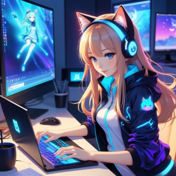

# 😎About Us

Felisware, an innovative organization, specializes in the development of a wide range of digital products, including video games, computer software, mobile applications, web solutions, vecode extensions, and AI models/services. With a dedicated team of experts, Felisware thrives on pushing the boundaries of technology to create immersive and cutting-edge experiences for users across various platforms. Whether it's crafting captivating video game worlds, designing intuitive mobile apps, or implementing advanced AI solutions, Felisware is committed to delivering excellence in every project it undertakes.

Driven by a passion for innovation and creativity, Felisware continuously explores new possibilities in the digital landscape. Through meticulous research and development, the organization stays at the forefront of technological advancements, ensuring its products remain relevant and impactful in today's fast-paced market. By harnessing the power of emerging technologies, such as AI and vecode extensions, Felisware endeavors to revolutionize the way users interact with digital content, offering unique and personalized experiences tailored to their needs and preferences.

Moreover, Felisware places a strong emphasis on collaboration and client satisfaction. By fostering open communication channels and prioritizing customer feedback, the organization ensures that its products not only meet but exceed expectations. Whether partnering with businesses to develop custom software solutions or engaging with gamers to create captivating gaming experiences, Felisware remains dedicated to delivering value and driving innovation in the digital realm. With a proven track record of success and a forward-thinking approach, Felisware continues to be a trusted partner for those seeking top-tier digital solutions.

# 📊Statistic

  
  

# 🏆Badges

